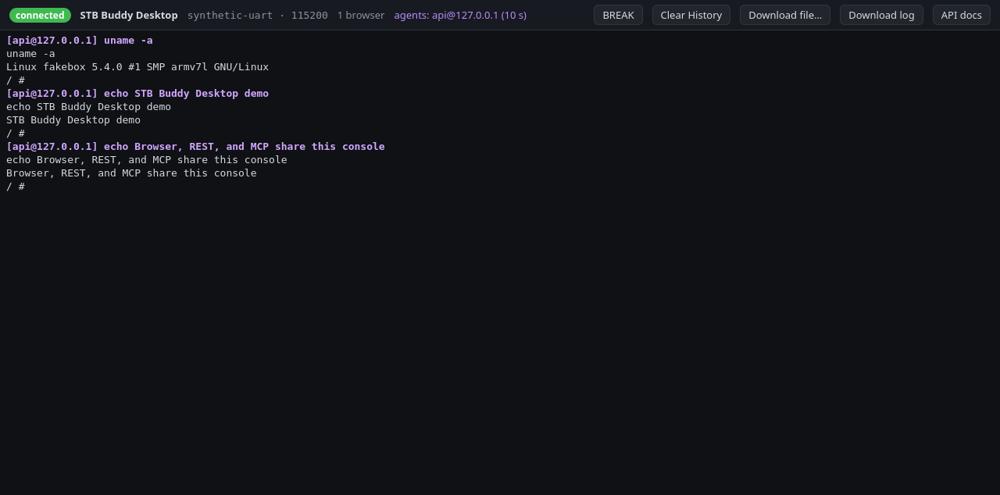
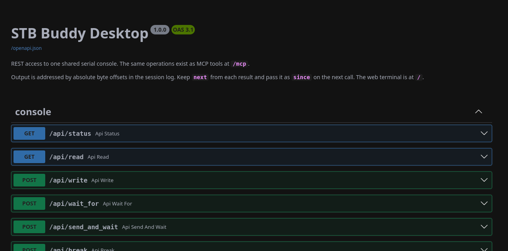

# STB Buddy Desktop

[](https://github.com/s1mb1o/stb-buddy-desktop/actions/workflows/ci.yml)
[](LICENSE)
[](https://www.python.org/)

STB Buddy Desktop shares one set-top-box serial console between a browser,
MCP clients, scripts, and terminal programs. It runs on a Linux desktop or
development host connected to the STB through a USB UART adapter.

It is the desktop-hosted counterpart to the embedded
[**stb-buddy**](https://github.com/s1mb1o/stb-buddy) appliance: the same
browser/MCP approach, with host features such as persistent logs, large
downloads, and a PTY for `minicom`.

> [!WARNING]
> STB Buddy Desktop has no authentication or TLS. It binds to loopback by
> default. Do not expose it to an untrusted network or the Internet. Anyone
> who can reach it can read the console, send commands, clear history, and
> download files from the attached board.

## Screenshots





Both screenshots were captured from the included fake board. They contain
synthetic test output only—no real STB identifiers, addresses, credentials, or
console data.

## Features

- Browser terminal based on xterm.js, with live output and keyboard input.
- MCP over Streamable HTTP for AI coding agents.
- REST API with a self-contained OpenAPI/Swagger interface.
- Shared, non-destructive console history with absolute byte offsets.
- One transmit lock for commands so concurrent clients do not interleave.
- Immediate reply-on-match for short bootloader and initramfs prompts.
- Verified file download over serial or `nc`, with SHA-256 validation.
- Persistent per-session logs and retained command annotations.
- PTY mirror for tools such as `minicom`.
- Automatic serial-port reopen after unplug/replug.
- Light and dark browser themes with no CDN dependency.

## Requirements

- Linux with Python 3.12 or newer.
- A 3.3 V USB UART adapter connected to the STB console.
- Permission to open the adapter, normally through the `dialout` group.
- [`uv`](https://docs.astral.sh/uv/) for the documented setup.

Use TTL voltage levels appropriate for the board. Do not connect an RS-232
interface directly to a 3.3 V UART.

## Install and run

```bash
git clone https://github.com/s1mb1o/stb-buddy-desktop.git
cd stb-buddy-desktop
uv sync --locked
```

Find the stable path for the adapter:

```bash
ls -l /dev/serial/by-id/
```

Start the service with that path:

```bash
uv run stb-buddy-desktop \
  --device /dev/serial/by-id/usb-YOUR_ADAPTER \
  --baud 115200
```

Then open:

- Web terminal: <http://127.0.0.1:8765/>
- OpenAPI documentation: <http://127.0.0.1:8765/docs>
- MCP endpoint: <http://127.0.0.1:8765/mcp>

The default device is `/dev/ttyUSB0`. Passing a stable `/dev/serial/by-id/`
path is strongly recommended.

If the adapter reports `Permission denied`, add the user to `dialout`, then
start a new login session:

```bash
sudo usermod -aG dialout "$USER"
```

To permit clients on a trusted LAN, opt in explicitly:

```bash
uv run stb-buddy-desktop \
  --device /dev/serial/by-id/usb-YOUR_ADAPTER \
  --host 0.0.0.0
```

Read [SECURITY.md](SECURITY.md) before enabling LAN access.

## MCP client setup

### Claude Code

```bash
claude mcp add --transport http --scope user \
  stb-buddy-desktop http://127.0.0.1:8765/mcp
```

### Codex

Add this to `~/.codex/config.toml`:

```toml
[mcp_servers.stb-buddy-desktop]
url = "http://127.0.0.1:8765/mcp"
tool_timeout_sec = 660
```

### OpenCode

Add a remote MCP server to the OpenCode configuration:

```json
{
  "mcp": {
    "servers": {
      "stb-buddy-desktop": {
        "type": "remote",
        "url": "http://127.0.0.1:8765/mcp",
        "timeout": {
          "catalog": 30000,
          "execution": 660000
        }
      }
    }
  }
}
```

Use the desktop host's trusted-LAN address instead of `127.0.0.1` only when
the MCP client runs on another machine and the service was started with
`--host 0.0.0.0`.

## MCP tools and REST endpoints

| MCP tool | REST endpoint | Purpose |
|---|---|---|
| `status` | `GET /api/status` | Connection, history, PTY, and client status. |
| `read` | `GET /api/read` | Read output without consuming it. |
| `write` | `POST /api/write` | Send raw text or control characters. |
| `wait_for` | `POST /api/wait_for` | Wait for a regular expression and optionally reply immediately. |
| `send_and_wait` | `POST /api/send_and_wait` | Run a shell command and return its output. |
| `download` | `POST /api/download` | Copy and SHA-256-verify a file from the board. |
| `clear_history` | `POST /api/clear_history` | Clear retained output and annotations for this session. |
| — | `POST /api/break` | Send a serial BREAK. |
| — | `GET /api/log` | Download a snapshot of the current session log. |
| — | `GET /api/downloads/{name}` | Fetch a completed board download. |

Example REST calls:

```bash
curl --fail http://127.0.0.1:8765/api/status

curl --fail \
  -H 'Content-Type: application/json' \
  http://127.0.0.1:8765/api/send_and_wait \
  -d '{"command":"uname -a"}'

curl --fail \
  -H 'Content-Type: application/json' \
  http://127.0.0.1:8765/api/write \
  -d '{"data":"\u0003","newline":false}'
```

## Short boot prompts

An MCP client may take several seconds to react to a prompt. `wait_for` and
`send_and_wait` therefore accept a `reply` value that the desktop service
sends immediately when the regular expression matches:

```json
{
  "command": "reboot",
  "pattern": "Hit any key",
  "reply": " ",
  "timeout": 120
}
```

The reply is sent exactly as supplied; Enter is not appended. Add `\r` when a
particular prompt requires it.

## File downloads

The `download` operation first confirms that the console is at a shell prompt,
then obtains the source size and SHA-256. Small files use verified base64
chunks over the serial console. Larger files try an ephemeral `nc` listener
and fall back to serial when `transport` is `auto`.

The board needs BusyBox-compatible `echo`, `wc`, `sha256sum`, `dd`,
`uuencode`, `cat`, `ifconfig`, and `nc` commands for the complete workflow.
Partial files keep a `.part` suffix; a completed file is published only after
its size and SHA-256 match the source.

## Use with minicom

The default PTY symlink is `/tmp/ttySTB`:

```bash
minicom -o -D /tmp/ttySTB
```

Use `-o` so `minicom` does not send a modem initialization string to the STB.
Do not open the raw adapter while STB Buddy Desktop owns it.

## State and logs

Runtime data is stored under `~/.local/state/stb-buddy-desktop/` by default:

- `console-<timestamp>.log` — raw bytes for one service session.
- `downloads/` — completed and partial board downloads.

`clear_history` replaces only the current session's live log. It does not
delete older session logs or downloaded files.

## Development

```bash
uv sync --locked
uv run ruff check .
uv run python tests/smoke_test.py
```

The automated smoke test launches the included fake board and a service on an
isolated loopback port. It never accesses a physical serial adapter.

See [TESTING.md](TESTING.md) for browser checks and optional hardware tests,
and [docs/spec.md](docs/spec.md) for the behavioral specification.

## License

STB Buddy Desktop is released under the [MIT License](LICENSE). Vendored
browser libraries retain their own license notices under
`src/stb_buddy_desktop/web/static/vendor/`.
