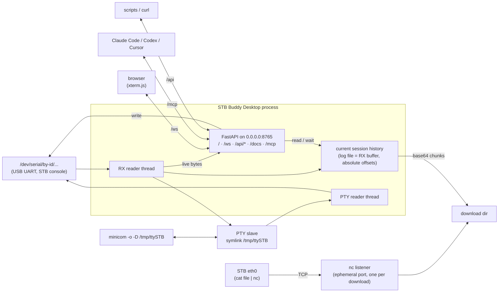
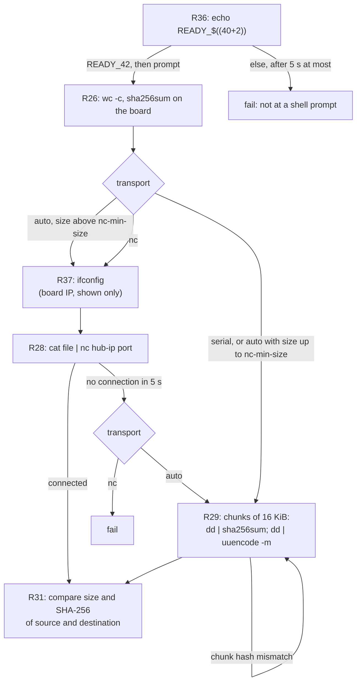

# STB Buddy Desktop specification

Version: 1.0.0

Status: implemented and covered by the fake-board smoke and manual tests.

## Purpose

STB Buddy Desktop is one long-running process that owns one serial console.
These parties can use the console at the same time and see the same output:

- AI agents (Claude Code, Codex, Cursor), through MCP over Streamable HTTP.
- Scripts and `curl`, through a REST API with OpenAPI docs.
- A human in a browser, through a web terminal.
- A human in `minicom`, through a PTY.

## Architecture



## Requirements

### Serial port

- R1. The hub MUST open the device exclusively. It MUST set `TIOCEXCL` on the port, so that a second program (for example `minicom` on the raw device) gets `EBUSY`.
- R2. The default device MUST be `/dev/ttyUSB0`. Documentation SHOULD recommend a stable `/dev/serial/by-id/` path. The default line setting MUST be 115200 8N1, no flow control.
- R3. The hub SHOULD survive an unplug and replug of the adapter. When the port fails, the hub MUST mark itself disconnected and retry the open every 1 s.
- R3a. The Enter key is CR (`\r`), the same byte that a terminal sends. `write(newline=true)` and `send_and_wait` append `\r`.

### RX buffer and log

- R4. One reader thread MUST read the port. It MUST append every received byte, unchanged, to a session log file `<log-dir>/console-<YYYYMMDD-HHMMSS>.log`. The default log directory is `~/.local/state/stb-buddy-desktop/`.
- R5. The session log file is the RX buffer. A position is an absolute logical byte offset. The hub MUST never drop output during a session except when a client explicitly calls `clear_history` (R45–R49). Reads MUST be non-destructive: two clients that read the same valid offset get the same bytes.
- R6. Offsets start at 0 when the hub starts and MUST NOT be reused after `clear_history`. `status.session` names the current process session. `buffer_start` is the oldest readable offset and `buffer_end` is the offset after the last received byte. If a client sends `since` below `buffer_start`, the hub MUST use `buffer_start`; if it sends `since` greater than `buffer_end`, the hub MUST use `buffer_end`.

### PTY for minicom

- R7. The hub MUST create a PTY in raw mode and point the symlink `/tmp/ttySTB` to the PTY slave. The hub MUST replace an existing symlink at that path. It MUST NOT replace a regular file.
- R8. The hub MUST copy received bytes to the PTY master. It MUST copy bytes from the PTY master to the port.
- R9. PTY writes MUST be non-blocking. When no program reads the PTY, the hub MUST drop the bytes for the PTY and count them in `status.pty_dropped`. The serial reader MUST never block on the PTY.
- R10. The hub MUST keep its own copy of the slave fd open. Otherwise reads on the master fail with `EIO` after minicom exits.

### HTTP server

- R11. One HTTP server MUST serve all endpoints on `127.0.0.1:8765` by default. There is no authentication. `--host 0.0.0.0` explicitly enables trusted-LAN access; any host that can reach the service can read and type on the STB console through the web terminal, REST API, and MCP.
- R12. Writes from agents and REST clients MUST go through one transmit lock. `send_and_wait` MUST hold the lock from the send until it returns, so that two clients never interleave commands. A write that waits more than 60 s for the lock MUST fail with "console busy". Input from the browser and the PTY is not locked.
- R13. Text results (MCP and REST) MUST be UTF-8 decoded with replacement characters, with `\r\n` normalized to `\n`, other `\r` removed, and ANSI escape sequences removed. The log file and the browser get the raw bytes.
- R14. The hub MUST record each agent or REST write as a note: offset, source, text, time. The source of an MCP write is the MCP client name (`clientInfo.name`). The source of a REST write is `api@<client IP>`. Notes are kept in memory for the session. Control characters in the note text use caret notation (`^C`).
- R15. `status.agents` MUST list the sources that called a tool or REST endpoint in the last 10 minutes, with the seconds since the last call.

### Web terminal

- R16. `GET /` MUST serve a web terminal page (xterm.js). All JavaScript and CSS MUST be served from the hub (vendored), with no CDN.
- R17. The page MUST follow the system light or dark preference (`prefers-color-scheme`) and update when the preference changes.
- R18. When the page connects, the hub MUST replay the last 100,000 lines of the retained current-session history, with the notes in that range in order. Then it MUST stream live output. The browser scrollback MUST hold 100,000 lines. A clear event (R48) MUST reset the terminal and its scrollback.
- R19. Agent and REST writes MUST show in the terminal as a colored note line: `[<source>] <text>`.
- R20. A status bar MUST show device, baud, connected or disconnected, the number of browsers, and the active agents (R15). It polls `GET /api/status` every 2 s.
- R21. The page MUST have a **BREAK** button (`POST /api/break`), a **Clear History** button (`POST /api/clear_history`), a **Download log** link (`GET /api/log`), and a **Download file…** button (R38).
- R22. When the WebSocket closes, the page MUST reconnect every 2 s, clear the terminal and replay again.

### WebSocket protocol (`/ws`)

OpenAPI does not describe WebSockets, so the protocol is described here.

| Direction | Frame | Content |
|---|---|---|
| hub → browser | binary | Raw console bytes (replay first, then live). |
| hub → browser | text | JSON note: `{"type": "note", "source": "...", "text": "...", "offset": 123}` |
| hub → browser | text | JSON clear event: `{"type": "clear", "next": 123}`. Reset the terminal and scrollback (R48). |
| browser → hub | binary | Keystrokes, raw bytes, written to the port without the transmit lock. |

### MCP endpoint

- R23. The hub MUST serve MCP over Streamable HTTP at `/mcp` on the same server.

### REST API

- R24. The hub MUST serve a REST API under `/api` with the same operations as the MCP tools. It MUST publish the OpenAPI document at `/openapi.json` and Swagger UI at `/docs`. Swagger UI MUST follow the system light or dark preference.

| Method and path | Body or query | Returns |
|---|---|---|
| `GET /api/status` | none | `Status` |
| `GET /api/read` | `since`, `max_bytes`, `timeout` | `Chunk` |
| `POST /api/write` | `{data, newline}` | `WriteResult` |
| `POST /api/wait_for` | `{pattern, since, timeout, reply}` | `WaitResult` |
| `POST /api/send_and_wait` | `{command, pattern, timeout, reply}` | `CommandResult` |
| `POST /api/break` | `{duration}` (default 0.25 s) | `{ok}` |
| `POST /api/clear_history` | none | `ClearHistoryResult` (R45–R49) |
| `GET /api/log` | none | the session log file, `text/plain`, as a download |
| `POST /api/download` | `{path, name, transport, timeout}` | `DownloadResult` (R25–R35) |
| `GET /api/downloads/{name}` | none | a file from the download directory (R34) |

### File download

`download` copies one file from the board to the desktop host. The service sends BusyBox shell commands on the console. Nothing is installed on the board. The board must be at the Linux shell prompt (`--prompt`), not in a bootloader. The service checks this first (R36).

Order of steps: shell check (R36), size and SHA-256 (R26), transport selection by size (R27), board IP if `nc` is tried (R37), transfer (R28 or R29), hash check (R31).

The commands below need BusyBox-compatible `echo`, `wc`, `sha256sum`, `dd`,
`uuencode`, `cat`, `ifconfig`, `nc`, and shell arithmetic.



- R25. `download` MUST copy the file `path` on the board to `<download-dir>/<name>` on the desktop host. The default download directory is `~/.local/state/stb-buddy-desktop/downloads/`. The default `name` is the last component of `path` (`/tmp/example` gives `example`). `name` MUST NOT contain `/`, and MUST NOT be `.` or `..`. The service replaces an existing file with the same name.
- R26. Before the transfer, the hub MUST get the size and the SHA-256 of the source from the board with `wc -c < '<path>'; sha256sum '<path>'`. If the command does not return both values (for example `Permission denied`), `download` MUST fail with the board's output in the error text. The hub MUST quote `path` for a POSIX shell in all commands.
- R27. `transport` is `auto` (the default), `nc` or `serial`. `auto` MUST use `serial` when the size from R26 is `--nc-min-size` bytes or less (default 65536, about 8 s over serial). For a larger file, `auto` MUST try `nc` first, and use `serial` when the board does not connect (R28). `nc` and `serial` MUST use only that transport, for any size.
- R28. `nc` transport:
  - The hub MUST listen on an ephemeral TCP port (port 0, the OS selects the port). No fixed port is assigned.
  - The service MUST send `cat '<path>' | nc <nc-host> <port>` on the console. `<nc-host>` is the `--nc-host` option. The default is the IPv4 address of the desktop-host interface that has the default route.
  - The service MUST accept one connection. It MUST read until EOF or until it has `size` bytes (R26), and then close the connection. It MUST NOT depend on `nc` closing the connection after EOF on stdin. Then it MUST wait for the prompt.
  - If no connection arrives in 5 s, the service MUST send Ctrl-C (`\x03`) and wait for the prompt. Then `auto` MUST continue with `serial`, and `nc` MUST fail.
  - The service MUST close the listener when the transfer ends or fails.
- R29. `serial` transport:
  - The service MUST read the source in chunks of 16384 bytes. For chunk N (N = 0, 1, ...), it MUST send one command: `dd if='<path>' bs=16384 skip=N count=1 2>&- | sha256sum; dd if='<path>' bs=16384 skip=N count=1 2>&- | uuencode -m x`. `2>&-` closes stderr, so `dd` prints no statistics and does not require writable `/dev/null`.
  - The service MUST decode the base64 lines between `begin-base64` and `====`. It MUST ignore lines that are not valid base64, for example kernel messages.
  - The service MUST compare the SHA-256 of the decoded chunk with the SHA-256 from the board. If they do not match, it MUST send the chunk command again, up to 3 more times. If the fourth attempt fails, `download` MUST fail.
  - The number of chunks is the size from R26 divided by 16384, rounded up.
- R30. TX lock (R12). The `serial` transport MUST take the TX lock for each chunk command, not for the whole transfer. Other agents can run commands between two chunks. The `nc` transport MUST hold the TX lock from the `cat | nc` command until the prompt returns.
- R31. Hash check. The hub MUST write received data to `<name>.part`. At the end, it MUST compare the size and the SHA-256 of `<name>.part` with the size and the SHA-256 of the source (R26). If both match, it MUST rename `<name>.part` to `<name>`. If they do not match, it MUST keep `<name>.part` and fail. The error text MUST contain both hashes.
- R32. `download` is synchronous. `timeout` is the limit for the whole call: default 600 s, maximum 600 s. When the timeout ends, `download` MUST fail and keep `<name>.part`. If an `nc` transfer is in progress, the service MUST send Ctrl-C first.
- R33. Every command that `download` sends is a note (R14). The base64 text goes into the session log and to the web terminal and the PTY, the same as other console output.
- R34. `GET /api/downloads/{name}` MUST return a file from the download directory, so that clients on other hosts can fetch it. It MUST NOT return `.part` files or paths outside the download directory.
- R34a. Errors. A REST call with an invalid `name` or `transport` MUST return 400 or 422. A failed download MUST return 503 with the reason in `detail`. The MCP tool MUST return the reason in the error text (it raises `ToolError`, see the gotcha in `AGENTS.md`).
- R35. `DownloadResult` MUST contain: `file` (path on the desktop host), `name`, `size`, `sha256_source` (from the board), `sha256_local` (of the file on the desktop host), `transport` (`nc` or `serial`, the transport that delivered the data), `seconds`, `retries` (the number of chunk commands that were sent again), and `board_ips` (R37; null when the service did not send `ifconfig`).
- R36. Shell check. Before R26, the service MUST send `echo READY_$((40+2))` and wait up to 5 s for a line that is exactly `READY_42`, followed by the prompt. Only a shell expands `$((40+2))`. The echoed command line has the text without expansion. If the check fails, `download` MUST fail with `the console is not at a shell prompt` and the received output. It MUST NOT send more commands or Ctrl-C for this download. Usual causes are a bootloader prompt, a running program, or partial typed input.
- R37. Board IP. When the hub is about to try `nc` (R27), it MUST first send `ifconfig`. It MUST collect the IPv4 addresses from `inet addr:<a.b.c.d>` (BusyBox) or `inet <a.b.c.d>` lines, except `127.0.0.1`, into `board_ips`. The addresses are for display only. The hub MUST NOT change the transport or the `nc` host because of them. If `ifconfig` gives no address, `board_ips` is an empty list. The hub MUST NOT send `ifconfig` when it uses only `serial`.
- R38. Web dialog (R21):
  - The top bar MUST have a **Download file…** button next to **Download log**.
  - The button opens a modal dialog with a text field "Full path on the board" and the buttons **Download** and **Cancel**. Enter in the field starts the download. Esc and **Cancel** close the dialog.
  - **Download** sends `POST /api/download` with `{"path": <field>}` (all other fields default). While the request runs, the dialog MUST show that it is busy, with the elapsed seconds. The field and the buttons are disabled, and Esc does not close the dialog. The dialog cannot stop a running download (R32).
  - On success, the dialog MUST show: name, size, transport, seconds, retries, the board IP addresses (when R37 ran), the SHA-256 of the source and of the copy, and that the two match. Then the browser MUST save the file with `GET /api/downloads/{name}`. The **Download** button MUST change to **Close**, and **Cancel** MUST be hidden. **Close** closes the dialog. A change to the path field, or opening the dialog again, MUST restore **Download** and **Cancel**. After a failure, the button stays **Download**.
  - On failure, the dialog MUST show `detail` from the response (R34a), for example the R36 error. The field stays filled, so the user can try again.
  - The dialog MUST follow the light or dark preference (R17).

Security (R11 applies): the `nc` listener accepts the first connection from any LAN host while it waits. The hash check (R31) rejects wrong data.

### Reply on match

An agent may need several seconds to react to output, while boot prompts often
wait for less time. The desktop service can therefore send a configured reply
as part of the wait operation.

```text
send_and_wait(command="reboot", pattern="Press \\[01R\\]", reply="1", timeout=120)
wait_for(pattern="Press \\[01R\\]", reply="1", timeout=120)   # a human power-cycles the board
```

- R39. `wait_for` and `send_and_wait` MUST accept an optional `reply` string. When `reply` is set and `pattern` matches, the hub MUST write `reply` to the port at once, before the call returns. The thread that runs the call writes the reply. The hub MUST NOT wait for the client. The result fields do not change: `matched: true` means that the hub sent the reply. The board's answer to the reply starts at `next` or later.
- R40. The service MUST send `reply` unchanged. It MUST NOT append Enter (R3a), because many short prompts read one key. The client adds `\r` when a prompt needs Enter. Control characters use JSON escapes, the same as in `write`. An empty `reply` is the same as null.
- R41. With `reply`, the call MUST hold the TX lock (R12) until the reply is written or the timeout ends. `wait_for` takes the lock before it starts to wait. `send_and_wait` holds the lock from the send (R12). Thus another agent cannot delay the reply. During a long wait, other agents and REST clients wait for the lock and fail with "console busy" after 60 s. Browser and PTY input are not locked. `wait_for` without `reply` does not take the lock.
- R42. The reply is an agent write. The hub MUST record it as a note (R14), so that humans see it in the web terminal (R19).
- R43. If `pattern` does not match before the timeout, the hub MUST NOT send `reply`. The result has `matched: false`.
- R44. The hub matches from `since`, the same as without `reply`. If the output after `since` already contains the pattern, the hub replies at once, also when the text is old. The client is responsible for `since`: use `null` ("from now"), or the `next` value of a call that ended after the last prompt.

### Clear history

- R45. `clear_history` MUST remove every retained RX byte and every note from the current process session. It MUST replace the current session log file with an empty file. It MUST NOT delete log files from older hub sessions, files in the download directory, agent activity, PTY state or serial-port state. It sends no bytes to the board.
- R46. Offsets MUST remain monotonic. On clear, `buffer_start` advances to the old `buffer_end`; `buffer_end` does not move. The returned `next` is this offset. New RX bytes start there. Reads with an older `since` clamp to `buffer_start`, so an in-progress wait or command can continue without mistaking new bytes for old bytes.
- R47. Clearing and appending RX data MUST be serialized, so no byte is partly retained or assigned the wrong offset. `ClearHistoryResult` MUST contain `cleared_bytes`, `cleared_notes` and `next`. A concurrent `GET /api/log` MUST finish with its fixed pre-clear snapshot even when clear replaces the live log file.
- R48. Every connected WebSocket client MUST receive the clear event after the server has cleared the history. The page MUST reset the xterm terminal and its complete scrollback. The **Clear History** button MUST ask for confirmation, call `POST /api/clear_history`, disable itself while the request runs, and show an error without clearing locally when the request fails.
- R49. The operation MUST be available as the MCP tool `clear_history` and as `POST /api/clear_history`. It records the caller as active (R15), but it MUST NOT add a note after clearing because the retained history must remain empty.

## MCP tools

| Tool | Arguments | Returns | Notes |
|---|---|---|---|
| `status` | none | `Status`: `device`, `baud`, `connected`, `session`, `log_file`, `buffer_start`, `buffer_end`, `pty_link`, `pty_dropped`, `web_clients`, `agents` | Use `buffer_end` as the first `since`. `buffer_start` is the oldest retained offset. |
| `read` | `since: int \| None`, `max_bytes: int = 65536`, `timeout: float = 0` | `Chunk`: `text`, `start`, `next` | `since=None` returns the last `max_bytes`. With `timeout > 0`, waits for data after `since`. |
| `write` | `data: str`, `newline: bool = True` | `WriteResult`: `written`, `offset` | `offset` is `buffer_end` before the write. Read from it to see the reply. Control characters use JSON escapes, for example `"\u0003"` for Ctrl-C. |
| `wait_for` | `pattern: str`, `since: int \| None`, `timeout: float = 30`, `reply: str \| None` | `WaitResult`: `matched`, `match`, `text`, `next` | Python regex. `since=None` means "from now". For boot messages, for example `Hit any key` or `login:`. With `reply`, the hub sends `reply` as soon as `pattern` matches (R39–R44). |
| `send_and_wait` | `command: str`, `pattern: str \| None`, `timeout: float = 30`, `reply: str \| None` | `CommandResult`: `output`, `matched`, `next` | Sends `command` and `\r`, then waits for `pattern`. The default pattern is the `--prompt` option. `output` excludes the echoed command line and the prompt. With `reply`, the hub sends `reply` as soon as `pattern` matches (R39–R44). |
| `download` | `path: str`, `name: str \| None`, `transport: "auto" \| "nc" \| "serial" = "auto"`, `timeout: float = 600` | `DownloadResult`: `file`, `name`, `size`, `sha256_source`, `sha256_local`, `transport`, `seconds`, `retries`, `board_ips` | Copies a file from the board to the desktop host and checks the SHA-256 of both sides (R25–R38). |
| `clear_history` | none | `ClearHistoryResult`: `cleared_bytes`, `cleared_notes`, `next` | Irreversibly clears the retained history for the current process session and all open web terminals; sends nothing to the board (R45–R49). |

`next` is the end of the data that the call scanned. Pass it as `since` on the next call.

## Command-line options

| Option | Default |
|---|---|
| `--device` | `/dev/ttyUSB0` |
| `--baud` | `115200` |
| `--host` | `127.0.0.1` |
| `--http-port` | `8765` |
| `--pty-link` | `/tmp/ttySTB` |
| `--log-dir` | `~/.local/state/stb-buddy-desktop` |
| `--prompt` | `[#$] $` |
| `--download-dir` | `~/.local/state/stb-buddy-desktop/downloads` (R25) |
| `--nc-host` | IPv4 address of the default route interface (R28) |
| `--nc-min-size` | `65536`: `auto` uses `serial` for files of this size or less (R27) |

## Out of scope for v1

- Several serial ports in one hub. Run one hub for each port, each with its own HTTP port and PTY link.
- Authentication, TLS.
- A command filter for dangerous commands (`reboot`, flash writes). Agents get the rules from their own instructions.
- File transfer, except `download` from the board to the desktop host (R25–R35). Still out of scope: upload to the board, XMODEM and ZMODEM, bootloader transfers, and `sudo` on the board.
- Protocol decoders.
- A `send_break` MCP tool. BREAK is available in the web UI and the REST API.
- Reply on match (R39–R44) has one pattern and one reply for each call. Out of scope: repeated key presses until a pattern shows (for boards with a zero boot delay), several pattern and reply pairs in one call (an `expect` script), and triggers that stay armed in the hub after the call returns.
- Automatic log rotation and clean-up. One log file per process session stays in the log directory unless its current contents are explicitly removed by `clear_history`; older session files are not touched.
- A bundled systemd unit. The user starts the service with the CLI.

## Open questions

1. **Prompt diversity.** The default `[#$] $` does not match every shell or bootloader; users may need `--prompt`.
2. **Adapter discovery.** Automatic selection among multiple USB UART adapters is not implemented.
3. **Authentication.** Remote access currently relies on loopback binding, host firewalls, and trusted networks rather than application authentication.
4. **Large serial transfers.** Downloads are synchronous and limited to 600 seconds; very large files should use `nc` or another board-specific transport.
